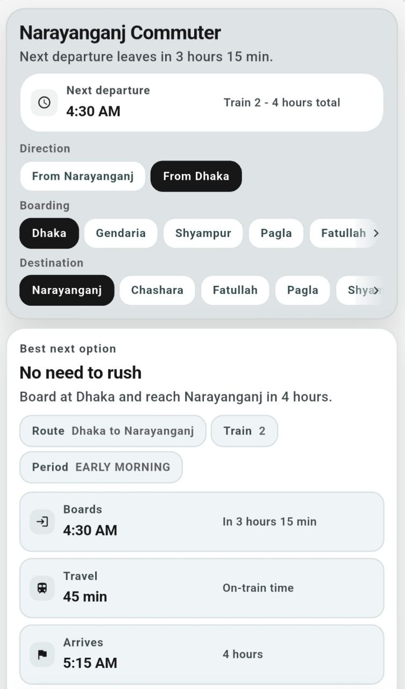
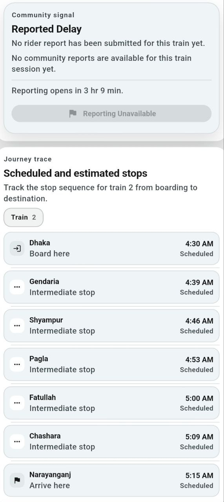
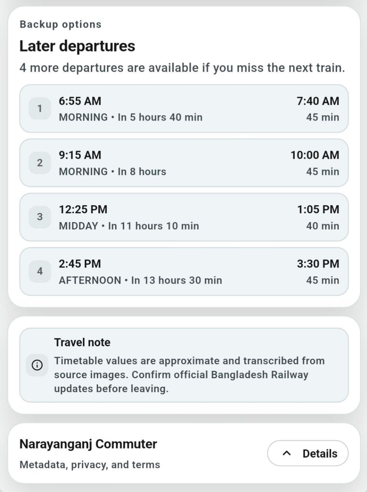

# Narayanganj Commuter

[](https://github.com/DevInsightForge/narayanganj_rail_schedule_app/actions/workflows/ci.yml)
[](https://github.com/DevInsightForge/narayanganj_rail_schedule_app/actions/workflows/publish.yml)
[](https://github.com/DevInsightForge/narayanganj_rail_schedule_app/releases)
[](https://flutter.dev)
[](LICENSE)

Mobile-first Flutter commuter rail app for the Dhaka-Narayanganj route. The app is centered on a compact rail board that keeps the official timetable as baseline truth and layers optional anonymous community delay signals on top.

## Current Status

- Startup is split into bootstrap, composition, and app-shell layers.
- Schedule loading is offline-first with bundled JSON as baseline, cached restoration, and Firebase Remote Config as a silent post-render update path.
- Rail UI is compact, monochrome, and optimized for phone-first usage.
- Anonymous Firebase-backed arrival reporting remains optional and secondary to the published schedule.
- Community delay insight, freshness, and downstream prediction remain isolated from the official schedule baseline.
- Footer metadata, privacy policy, and terms now live in an in-app drawer with static app-owned content.

## Core Features

- Next-train decision board with wait time, ETA, and route context
- Direction, boarding, and destination selection with deterministic state updates
- Journey trace with scheduled stops and optional predicted downstream timing
- Backup departure list for the active route selection
- Anonymous arrival reporting and community delay aggregation
- Graceful fallback when Firebase is disabled, unavailable, or partially degraded

## Schedule and Firebase Behavior

- Bundled schedule JSON is the non-negotiable baseline.
- Cached schedule data restores quickly when available.
- Firebase Remote Config can deliver versioned schedule updates after initial render.
- Firebase Anonymous Auth, Firestore, and App Check are optional at runtime and can be disabled through env configuration.
- Community features are enabled only after Firebase initializes successfully and degrade safely when it does not.
- Community overlay reads are one-shot and cached locally for 5 minutes per session to keep Firestore usage predictable on Spark.

## Local Setup

```bash
flutter pub get
flutter test
flutter run
```

Optional root `.env`:

```env
# Optional override: set to false to disable Firebase.
FIREBASE_ENABLED=true
FIREBASE_APPCHECK_ENABLED=false

# Minimal required Firebase env values.
FIREBASE_PROJECT_ID=
FIREBASE_API_KEY=

# Optional platform-specific API key overrides.
FIREBASE_WEB_API_KEY=
FIREBASE_ANDROID_API_KEY=
FIREBASE_IOS_API_KEY=

# Optional web analytics / App Check web config.
FIREBASE_MEASUREMENT_ID=
FIREBASE_APPCHECK_WEB_KEY=
```

## Release Notes

- Android release requires a configured Android SDK on the build machine.
- Android release signing requires `android/key.properties`.
- Android Firebase-backed release behavior may require `android/app/google-services.json` depending on your release setup.
- If `FIREBASE_APPCHECK_ENABLED=true`, Firebase App Check must already be configured in Firebase Console for the target platform.

## Firebase Security Baseline

- Firestore config is versioned in [firebase.json](firebase.json), [firestore.rules](firestore.rules), and [firestore.indexes.json](firestore.indexes.json).
- Train sessions are generated dynamically from bundled schedule templates using deterministic session IDs.
- `station_reports` writes require Firebase Anonymous Auth and enforce `reporterUid == request.auth.uid`.
- Arrival report submission is treated as successful only after the Firestore write completes.
- `session_status_snapshots/{sessionId}` is the primary read path for optional community overlay data.
- `predicted_stops` is now treated as legacy/administrative Firestore structure and is not read by the app in normal flows.
- `user_profiles` is owner-write metadata only with no client reads.
- `user_profiles` writes are capped to the first successful Firebase handshake on a device instead of being treated as a heartbeat channel.

## Firebase Spark Plan Considerations

- Firestore is used only for optional community-driven signals:
  - anonymous arrival report writes into `station_reports`
  - aggregate session overlay reads from `session_status_snapshots/{sessionId}`
  - one-time anonymous identity bootstrap metadata in `user_profiles`
- Spark free-tier limits to design around:
  - `50,000` document reads per day
  - `20,000` document writes per day
  - `20,000` document deletes per day
  - `1 GiB` stored data
  - `10 GiB` outbound data per month
- The app does not rely on Firestore TTL, PITR, backups, restore, or clone. Those are not assumed available for this app's operating model.
- Retention strategy is Spark-safe:
  - Firestore is treated as a short-horizon community signal store, not long-term truth
  - the client only reads narrow session overlay docs and caches them locally for 5 minutes
  - report submission uses client-side cooldown, dedupe, and persisted submission ledger to avoid read-before-write verification
  - old `station_reports` data should be cleaned up manually or administratively when needed
- Recommended operational guidance:
  - keep `session_status_snapshots/{sessionId}` compact and aggregate-oriented
  - avoid realtime listeners for community overlay data
  - avoid broad `station_reports` scans and per-stop polling
  - avoid writing `user_profiles` on every app launch, resume, or refresh
  - prefer schedule-only mode if Firebase is misconfigured or degraded
- Risky patterns to avoid:
  - querying many stops individually for the same train session
  - reading `predicted_stops` subcollections on every refresh
  - writing profile heartbeat metadata on every session
  - depending on Firestore cleanup features that require Blaze billing
- The app remains fully usable with Firebase disabled or degraded because the official bundled/cached timetable stays offline-first.

## Showcase

### Header and Decision Panel


### Community Report and Journey Timeline Panel


### Backup Schedules Panel

