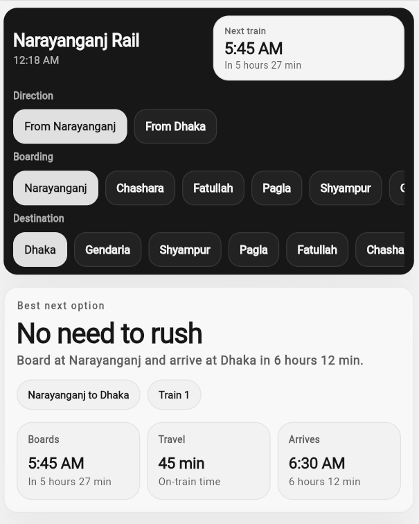
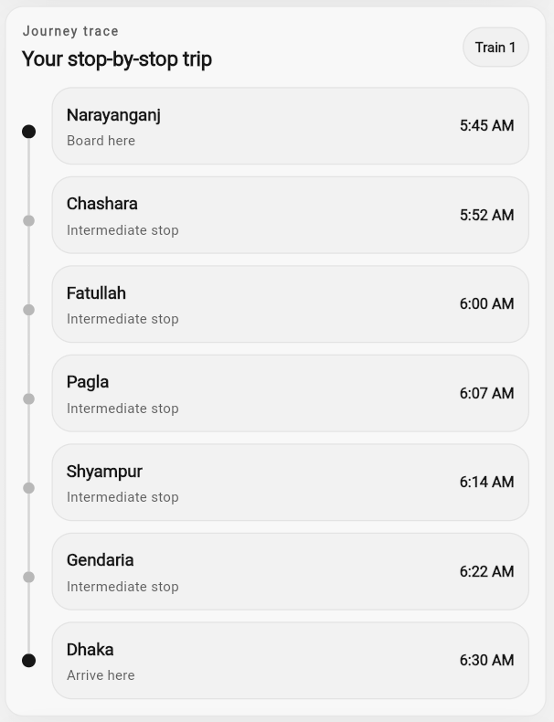
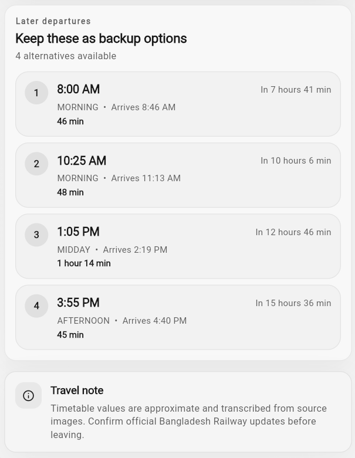

# Narayanganj Rail Schedule

[](https://github.com/DevInsightForge/narayanganj_rail_schedule_app/actions/workflows/ci.yml)
[](https://github.com/DevInsightForge/narayanganj_rail_schedule_app/actions/workflows/publish.yml)
[](https://github.com/DevInsightForge/narayanganj_rail_schedule_app/releases)
[](https://flutter.dev)
[](LICENSE)

Mobile-first Flutter commuter rail app for the Dhaka-Narayanganj route. It turns dense timetable data into a fast decision board for everyday trips.

## Features

- Next-train decision view with ETA, wait time, and route context
- Direction, boarding, and destination switching with deterministic state reconciliation
- Remote schedule loading from fixed website API endpoint with strict validation
- Safe fallback chain: `remote API -> cached valid payload -> bundled static data`
- Structured logging for remote loading branches and validation failures
- Android system bars styled to match app surface (no default gray status bar)

## Remote Data Configuration

The app derives schedule API URL from `WEBSITE_BASE_URL`.

- Base URL env key: `WEBSITE_BASE_URL`
- Derived schedule URL: `<WEBSITE_BASE_URL>/api/schedule/data.json`
- Default base URL: `https://narayanganj-rail-schedule.pages.dev/`

## Local Setup

```bash
flutter pub get
flutter test
flutter run
```

Optional root `.env`:

```env
WEBSITE_BASE_URL=https://narayanganj-rail-schedule.pages.dev/
```

## Showcase

### Header and Decision Panel


### Journey Trace Panel


### Upcoming Trains Panel

