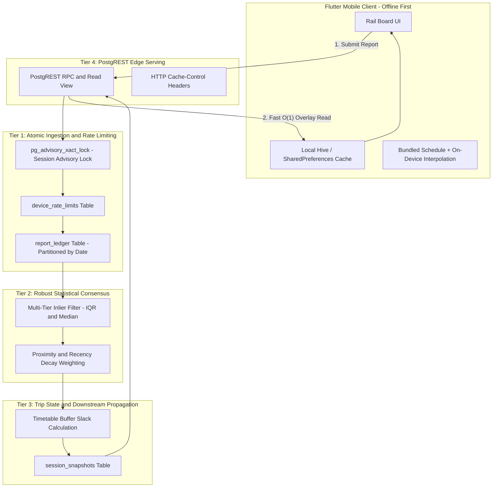

# Transit Database Architecture & Production Schema Specification
**Narayanganj Commuter: Real-Time Community Delay & Prediction Engine**

---

## 1. Executive Summary & Core Business Model

### 1.1 Context & Operational Reality
Narayanganj Commuter serves passengers traveling along the Dhaka–Narayanganj commuter rail corridor (7 stations: Dhaka, Gendaria, Shyampur, Pagla, Fatullah, Chashara, Narayanganj). The service operates 16 daily scheduled trips (8 forward, 8 reverse).

Commuters experience frequent, unannounced delays caused by junction congestion, single-track bottlenecks, and rolling stock issues. Because Bangladesh Railway provides no official real-time GPS telemetry API, this app crowdsources arrival reports directly from passengers on trains and platforms.

### 1.2 The Problem with Naive Database Architectures
A naive approach—such as storing dynamic delay state inside an unstructured JSONB blob on a single table row—introduces severe failure modes in transit production:
1. **Concurrency Bottlenecks & Row Locking:** When 50 commuters tap "Arrived" during rush hour at Narayanganj, all transactions contend for the exact same database row, causing lock escalation, timeouts, and serialization failures.
2. **MVCC Write Amplification & Table Bloat:** PostgreSQL writes an entirely new row version on every update. Constantly rewriting multi-kilobyte JSONB blobs rapidly fragments disk storage and burns through Supabase's 500 MB free tier.
3. **Violations of Transit Physics:** Simple averaging across stations distorts predictions. If a train was on time at Stop 1 and delayed by 15 minutes at Stop 4, averaging them yields 7.5 minutes—an impossible number that contradicts physical reality. Passed stops are historical facts; downstream stops must inherit upstream delay.
4. **Vulnerability to Outliers & Sybil Attacks:** A single malicious actor submitting $+120$ minutes can corrupt the entire board without robust statistical consensus.

---

## 2. Industry-Standard Architecture (GTFS-RT, Transit App, Citymapper)

To achieve enterprise-grade reliability with zero backend server maintenance, the architecture mirrors the four decoupled tiers standard in modern transit systems:



### 2.1 The Four Decoupled Tiers
1. **Tier 1: Ingestion & Gating (`report_ledger` + `device_rate_limits`):**
   - Append-only telemetry log.
   - Atomic 120-second cooldown per device.
   - Enforces unique report per `(service_date, session_id, station_id, device_id)`.
   - Bounded plausibility check: delays outside $[-15\text{m}, +180\text{m}]$ are rejected at the gate.
2. **Tier 2: Statistical Consensus Engine:**
   - Multi-tier inlier filter: discrete median for small samples ($N \in [3, 4]$); Interquartile Range (IQR) filtering for larger samples ($N \ge 5$).
   - Dual-exponential decay weighting: gives higher trust to observations close to scheduled arrival and close to current clock time.
3. **Tier 3: Downstream Propagation & Trip State (`session_snapshots`):**
   - Tracks current head-of-train position.
   - Downstream stops inherit current delay minus schedule recovery buffer slack.
   - Confidence score expands uncertainty over downstream stop distance.
4. **Tier 4: Zero-Cost Serving Projection:**
   - Compiled snapshot table queryable in $O(1)$ via PostgREST.
   - Injected `Cache-Control: max-age=15, s-maxage=15` headers to offload repeated reads to CDN edge.

---

## 3. Downstream Delay Propagation Math

### 3.1 The Transit Invariant
Commuter trains move strictly forward through a sequential station corridor:
$$\text{Dhaka (0)} \to \text{Gendaria (1)} \to \text{Shyampur (2)} \to \text{Pagla (3)} \to \text{Fatullah (4)} \to \text{Chashara (5)} \to \text{Narayanganj (6)}$$

Let $i^* \in \{0, \dots, 6\}$ be the latest station with verified commuter consensus, and let $D_{i^*}$ be its observed delay in minutes.

### 3.2 Propagation Rules
1. **Passed / Current Stops ($i \le i^*$):**
   $$\text{PredictedDelay}_i = D_i^{\text{consensus}}$$
   $$\text{Status}_i = \text{'observed'}$$
   $$\text{Uncertainty}_i = 0\text{ seconds}$$

2. **Downstream Unvisited Stops ($k > i^*$):**
   Train schedules include padding buffers $B_j$ before terminal approaches (e.g. 2 minutes between Fatullah and Chashara).
   $$\Delta \text{Buffer}_{i^* \to k} = \sum_{j = i^* + 1}^{k} B_j$$
   $$\text{PredictedDelay}_k = \max\left(0, \; D_{i^*} - \lfloor \frac{\Delta \text{Buffer}_{i^* \to k}}{60} \rfloor\right)$$
   $$\text{PredictedArrival}_k = \text{ScheduledArrival}_k + \text{PredictedDelay}_k$$

3. **Confidence Decay Across Downstream Horizon:**
   Confidence naturally attenuates the further down the line a station is from the last reported observation:
   $$\text{Confidence}_k = \text{Confidence}_{i^*} \times \left(\frac{1}{1 + 0.15 \times (k - i^*)}\right) \times \exp\left(-\frac{\Delta t_{\text{staleness}}}{1200\text{s}}\right)$$

---

## 4. Statistical Consensus & Anti-Abuse Specifications

### 4.1 Multi-Tier Outlier Filtering
- **Sample Size $N < 3$:** Clamped mean with low confidence score ($0.25 - 0.40$).
- **Sample Size $N \in [3, 4]$:** Discrete Median:
  $$\text{Consensus} = \text{percentile\_disc}(0.5) \text{ WITHIN GROUP } (\text{ORDER BY delay\_minutes})$$
- **Sample Size $N \ge 5$:** IQR Outlier Elimination:
  $$\text{IQR} = Q_3 - Q_1$$
  $$\text{Inlier Boundary} = [Q_1 - 1.5 \times \text{IQR}, \; Q_3 + 1.5 \times \text{IQR}]$$
  Reports falling outside this boundary are discarded as outliers before computing the weighted average.

### 4.2 Dual-Exponential Decay Weighting
Each report receives a statistical weight $W \in [0.10, 1.00]$ based on scheduled proximity and submission recency:
$$W = \exp\left(-\frac{|\text{observed\_at} - \text{scheduled\_at}|}{1800\text{s}}\right) \times \exp\left(-\frac{\text{now}() - \text{observed\_at}}{1200\text{s}}\right)$$
Clamped such that $W = \max(0.10, \min(1.00, W))$.

### 4.3 Atomic Lockless Cooldown (Race-Condition Free)
Checking cooldown via `SELECT 1 FROM ledger ...` suffers from Time-of-Check to Time-of-Use (TOCTOU) race conditions under concurrent network taps.
Instead, we maintain an atomic `device_rate_limits` table with conditional updates:
```sql
INSERT INTO public.device_rate_limits (device_id, last_reported_at, report_count_today)
VALUES (p_device_id, v_now, 1)
ON CONFLICT (device_id) DO UPDATE
SET 
  report_count_today = CASE 
    WHEN public.device_rate_limits.last_reported_at < v_now - interval '24 hours' THEN 1
    ELSE public.device_rate_limits.report_count_today + 1
  END,
  last_reported_at = EXCLUDED.last_reported_at
WHERE public.device_rate_limits.last_reported_at <= v_now - interval '2 minutes';
```
If zero rows are updated, PostgreSQL raises exception code `P0429` (Rate Limited) immediately.

---

## 5. Concurrency & Locking Strategy

### 5.1 The Concurrency Hazard
During rush hours, dozens of commuters tap arrival at the same time. If multiple transactions execute row-level `SELECT ... FOR UPDATE` on `session_snapshots` and insert into `report_ledger`, lock ordering deadlocks and serialization failures occur.

### 5.2 Transaction Advisory Locks
We serialize execution **strictly per train session** using PostgreSQL transaction advisory locks:
```sql
PERFORM pg_advisory_xact_lock(hashtext('session_' || p_session_id));
```
- **Guarantees:**
  - Reports for the same train session (e.g. `narayanganj_line:dhaka_to_narayanganj:02`) queue in memory without deadlocking.
  - Reports for different trains (e.g. train 04 vs train 07) run fully in parallel across different CPU cores with zero contention.
  - Zero disk I/O and zero row lock bloat; lock is automatically released upon transaction commit or rollback.

---

## 6. Supabase Free Tier Production Optimization (<500 MB Limit)

### 6.1 Storage Math & Footprint Breakdown
On Supabase Free Tier, database storage is capped at 500 MB.
- **Snapshot Table (`session_snapshots`):** 16 train runs per day $\times$ 365 days = 5,840 rows/year $\approx$ 2.5 MB/year.
- **Raw Telemetry (`report_ledger`):** Ephemeral. A report's useful lifespan is $< 24$ hours.
- **Data Compactness:**
  - `smallint` (2 bytes) for delays, sequences, counts.
  - `uuid` (16 bytes) for `device_id`.
  - `date` (4 bytes) for `service_date`.

### 6.2 Zero-Bloat Table Partitioning
Traditional `DELETE FROM report_ledger WHERE ...` leaves dead tuples in PostgreSQL heap pages, requiring manual `VACUUM FULL` to reclaim space.
**Solution:** Daily range partitioning on `service_date`. Dropping a 48-hour-old partition (`DROP TABLE report_ledger_2026_09_07`) is an instantaneous $O(1)$ filesystem unmap that releases physical pages to the OS instantly with zero table locks and zero WAL amplification.

### 6.3 Automated Partition Maintenance via `pg_cron`
Supabase Free Tier includes `pg_cron`. A scheduled daily job at 03:00 UTC pre-creates tomorrow's partition and drops partitions older than 48 hours:
```sql
SELECT cron.schedule(
  'maintain-report-partitions-job',
  '0 3 * * *',
  'SELECT public.maintain_report_partitions();'
);
```

### 6.4 The 7-Day Inactivity Pause Mitigation
- **GitHub Actions Trap:** GitHub disables cron workflows after 60 days of repo inactivity.
- **Production Solution:** Use an external free monitor (**Cron-job.org** or **UptimeRobot**) configured to send a lightweight `GET /rest/v1/session_snapshots?limit=1` with `apikey` header every 6 hours. This guarantees the database never pauses.

---

## 7. Row Level Security (RLS) & PostgREST Policy

```sql
-- Principle of Least Privilege
ALTER TABLE public.report_ledger ENABLE ROW LEVEL SECURITY;
ALTER TABLE public.device_rate_limits ENABLE ROW LEVEL SECURITY;
ALTER TABLE public.session_snapshots ENABLE ROW LEVEL SECURITY;

-- Completely seal raw ledger and rate limits from public direct access
REVOKE ALL ON public.report_ledger FROM anon, authenticated;
REVOKE ALL ON public.device_rate_limits FROM anon, authenticated;

-- Allow public read-only access to compiled snapshots
REVOKE ALL ON public.session_snapshots FROM anon, authenticated;
GRANT SELECT ON public.session_snapshots TO anon, authenticated;

CREATE POLICY "Allow public read-only snapshots" ON public.session_snapshots
  FOR SELECT USING (true);

-- Allow public execution of the atomic stored procedure
GRANT EXECUTE ON FUNCTION public.submit_arrival_report TO anon, authenticated;
```

---

## 8. Client Exception Mapping Matrix

When PostgreSQL encounters an exception, PostgREST returns HTTP 400 with a structured JSON body:
```json
{
  "code": "P0429",
  "details": null,
  "hint": null,
  "message": "RATE_LIMITED: Cooldown active. Please wait 2 minutes."
}
```

The Flutter `ApiClient` and `HttpArrivalReportRepository` map these specific Postgres error codes and prefixes directly to domain exceptions:

| Postgres Code | Message Prefix | Domain Exception | User Feedback Copy |
|---|---|---|---|
| `P0429` | `RATE_LIMITED` | `RateLimitExceededException` | *"Please wait 2 minutes before reporting again."* |
| `P0430` | `STATION_CAPACITY_REACHED` | `StationCapacityReachedException` | *"Arrival reporting is full for this station right now."* |
| `P0431` | `ALREADY_SUBMITTED` | `DuplicateReportException` | *"Arrival report already recorded for this train."* |
| `P0001` | `INVALID_DATA` | `InvalidPayloadException` | *"Arrival report could not be submitted. Please verify."* |
